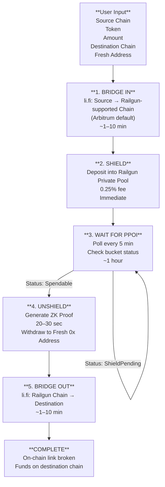

# new-wallet-fundr

A streamlined tool to **privately fund a fresh wallet across chains** — automating the full flow:  
**Bridge-in → Shield → Wait for PPOI → Unshield → Bridge-out**

Inspired by the Railgun-focused approach in the video ["3 ways to fund ETH wallet privately 2026"](https://youtu.be/ppRz6Hqoics), `new-wallet-fundr` makes it easy to break on-chain links between your funding source and your DeFi activity — all without relying on centralized services or complex manual steps.

> ⏳ **Note**: Due to time constraints at Hack Money, this project remains in the **design and planning phase**.  
> No full implementation was completed. This README outlines the intended architecture, flow, and vision.

---

## 🎯 The Problem

When you fund a new wallet from an established address, you carry its history with you.  
That address becomes your public identity onchain — linked to your past transactions, net worth, and behavior.

Tools like **Railgun** enable private transactions, but the process is **manual, slow, and error-prone**:

- Bridge funds
- Shield into Railgun
- Wait for PPOI (Privacy Pool Origin Integrity)
- Unshield to fresh address
- Bridge out

One misstep breaks privacy.

`new-wallet-fundr` **automates the entire flow** — so privacy becomes routine, not risky.

---

## 🔧 How It Works

The tool orchestrates a 5-step journey:

1. **Bridge-in** (via [li.fi](https://li.fi))  
   → Move funds from source chain to a Railgun-supported chain (e.g., Arbitrum)

2. **Shield**  
   → Deposit into Railgun’s private pool (0.25% fee)

3. **Wait for PPOI**  
   → Poll Railgun’s bucket status every 5 minutes until spendable (~1 hour)

4. **Unshield**  
   → Generate ZK proof, withdraw to a fresh, unlinkable address

5. **Bridge-out** (via [li.fi](https://li.fi))  
   → Send funds to final destination chain

Result:  
✅ On-chain link broken  
✅ Funds on destination chain  
✅ No history, no labels, no trace

---

## 🛠️ Technical Design

### V1: CLI / Simple UX

- **Interface**: Command-line or lightweight web (e.g., HTML + htmx)
- **Input**: `--source-chain`, `--token`, `--amount`, `--destination-chain`, `--fresh-address` (optional)
- **Execution**: Local script (Node.js/Python) orchestrates flow
- **Wallet**: Read-only access to funding wallet; generates fresh EOA offline

### V2 (stretch): Local AI Chatbot & Privacy Backend Flexibility

- **Interface**: Natural language input via **Ollama** (e.g., `phi-3`, `llama3`)
- **Example**:
  > _“Move 2 ETH from my main wallet to a private wallet on Base”_  
  > → Parsed, validated, executed — all **on-device, no cloud**
- **Privacy**: No data leaves the user’s machine

- **Alternative Privacy Backend**:  
  While V1 focuses on **Railgun**, future versions could integrate **Privacy Pools** as a compliant alternative.  
  Privacy Pools’ [developer guide](https://docs.privacypools.com/dev-guide) shows how to programmatically interact with pools, generate exclusion proofs, and manage associations — making it a strong candidate for **V2 automation** and **AI-driven privacy routing**.

  This opens the door to:
  - Choosing the best privacy layer based on chain, amount, or compliance needs
  - Letting the local AI agent decide: _“Use Railgun for max privacy, or Privacy Pools if interacting with regulated apps”_

---

## 🔗 Integration with li.fi

`new-wallet-fundr` uses the **[li.fi SDK](https://docs.li.fi/)** for both bridge-in and bridge-out steps.  
This enables:

- Universal routing across 20+ chains
- Best-rate aggregation
- Gas-efficient swaps

By leveraging li.fi, the tool remains **chain-agnostic** and immediately useful for real-world cross-chain flows.

---

## 🌐 Flow Diagram

